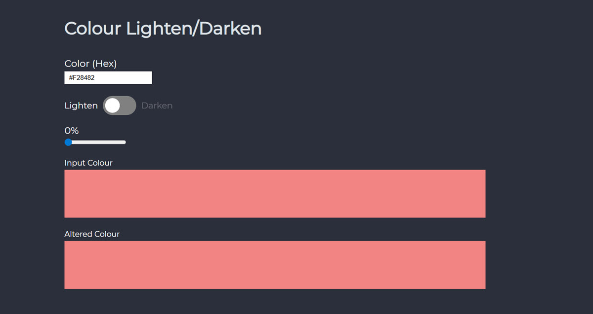

# Colour Tool

### Desktop

## Content

This was a fun project I completed by following along with a [Scrimba](https://scrimba.com/build-a-color-tool-in-vanilla-javascript-c01n) tutoral on how to create a color tool with Javascript.

The tutorial was taught by [James Q Quick](https://www.jamesqquick.com/)

For this one, I followed the tutorial, since I knew there were going to be some concepts I hadn't used before. I followed along and made it work as in the tutorial then I when back in afterwards and tweaks some of the CSS to make it more bespoke to me.
